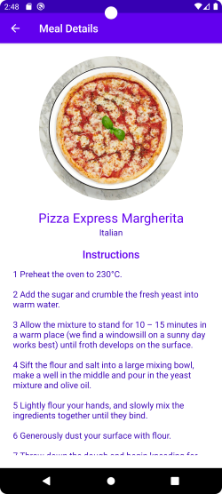

# My Foodie Android App

## Project Overview

An android application that lets users to search for meals based on categories and lets them archive the meals

## Screenshots
 

## How to Run

1. Download Android Studio
2. Set up anroid emulator (physical device can also be used)
3. Hit the run button

## Scope of Funtionality

The application supports:

- Searching for meals
- Look up instructions on how to make the meals
- Saving the meals 

## Technologies Used
- Kotlin
- Jetpack Compose
- MVVM & Repository pattern
- Retrofit for rest API
- Room for accessing the SQLite database

## License

[MIT License](License)
